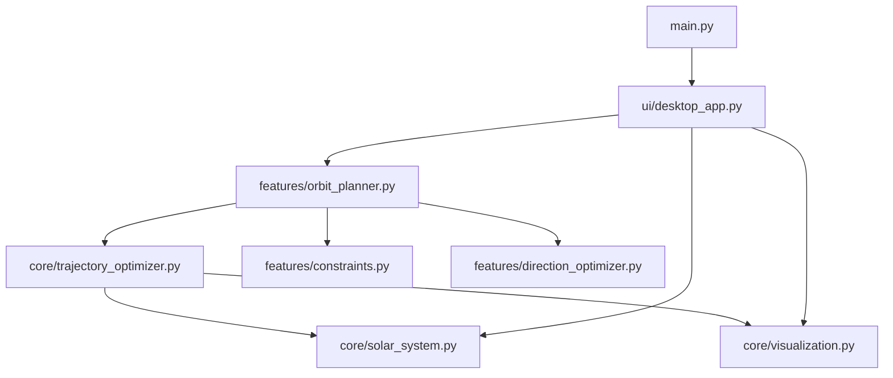
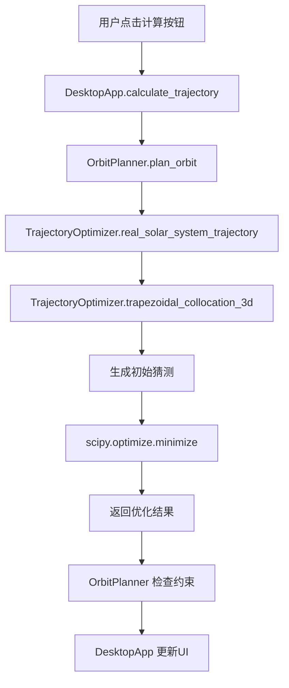
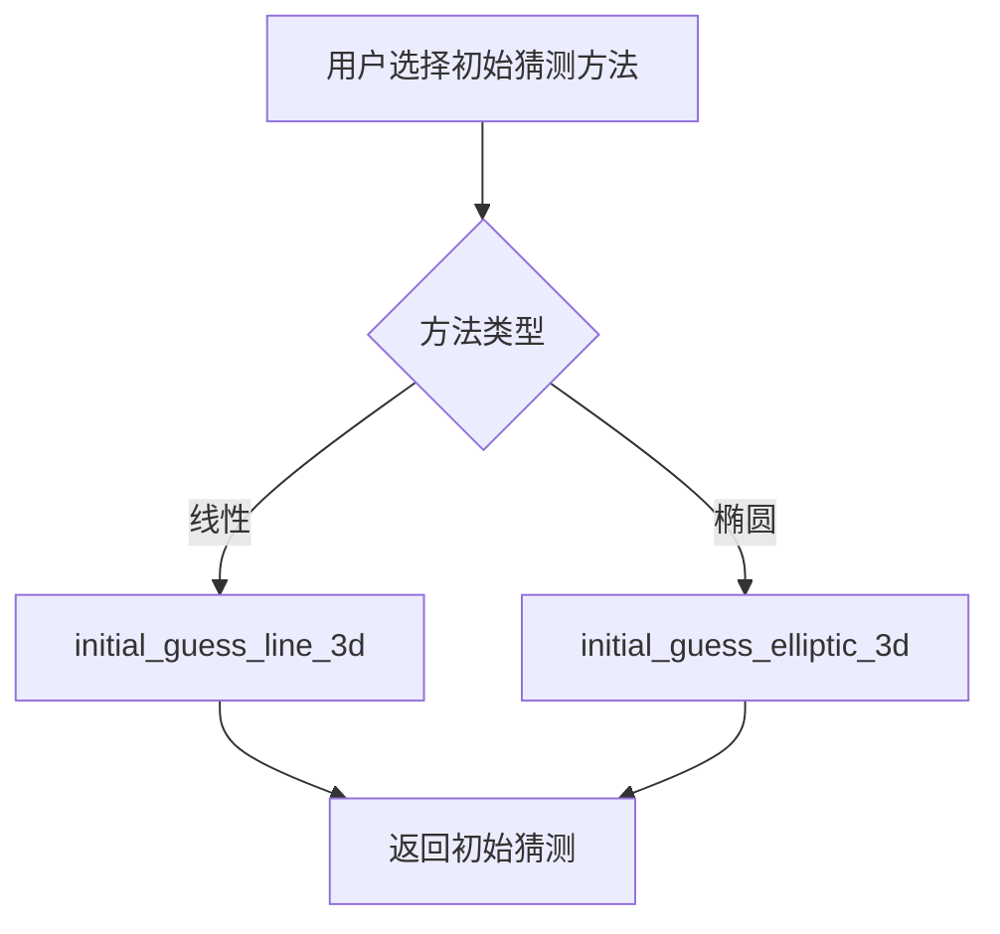

# 太阳系轨道设计工具 - 代码结构分析

## 1. 整体架构

### 1.1 目录结构

```
├── main.py                 # 主程序入口
├── ui/
│   └── desktop_app.py      # 桌面应用UI
├── features/
│   ├── orbit_planner.py    # 轨道规划
│   ├── constraints.py      # 约束检查
│   ├── direction_optimizer.py  # 方向优化
│   └── porkchop.py         # 猪排图计算
├── core/
│   ├── trajectory_optimizer.py  # 轨迹优化核心
│   ├── solar_system.py     # 太阳系模型
│   └── visualization.py    # 可视化工具
├── utils/
│   ├── config.py           # 配置
│   └── data_processor.py   # 数据处理
└── Param.py                # 参数配置
```

### 1.2 模块依赖关系



## 2. 核心模块分析

### 2.1 主程序入口 (main.py)

**功能**：启动桌面应用
**调用关系**：
- 导入并实例化 `DesktopApp`
- 启动主事件循环

### 2.2 桌面应用 (ui/desktop_app.py)

**主要类**：`DesktopApp`
**核心方法**：
- `calculate_trajectory()`：计算轨迹
- `_update_trajectory_plot()`：更新轨迹图
- `_update_thrust_plots()`：更新推力曲线
- `_init_core_module()`：初始化核心模块

**调用关系**：
- 调用 `features.orbit_planner.OrbitPlanner.plan_orbit()`
- 调用 `core.solar_system.SolarSystem` 进行太阳系可视化

### 2.3 轨道规划 (features/orbit_planner.py)

**主要类**：`OrbitPlanner`
**核心方法**：
- `plan_orbit()`：规划轨道
- `validate_input()`：验证输入参数
- `calculate_launch_window()`：计算发射窗口

**调用关系**：
- 调用 `core.trajectory_optimizer.TrajectoryOptimizer.real_solar_system_trajectory()`
- 调用 `features.constraints.Constraints` 检查约束

### 2.4 轨迹优化 (core/trajectory_optimizer.py)

**主要类**：`TrajectoryOptimizer`
**核心方法**：
- `trapezoidal_collocation_3d()`：3D轨迹优化
- `real_solar_system_trajectory()`：真实太阳系轨迹
- `compute_porchop_diagram()`：计算猪排图
- `initial_guess_line_3d()`：线性初始猜测
- `initial_guess_elliptic_3d()`：椭圆轨道初始猜测

**调用关系**：
- 调用 `core.solar_system.SolarSystem` 获取星体位置和速度
- 调用 `scipy.optimize.minimize` 进行优化

### 2.5 太阳系模型 (core/solar_system.py)

**主要类**：`SolarSystem`
**核心方法**：
- `calculate_body_position()`：计算星体位置
- `calculate_body_velocity()`：计算星体速度
- `plot_solar_system_enhanced()`：绘制美化的太阳系

### 2.6 约束检查 (features/constraints.py)

**主要类**：`Constraints`
**核心方法**：
- `check_thrust_constraint()`：检查推力约束
- `check_sun_distance_constraint()`：检查太阳距离约束

## 3. 函数调用流程图

### 3.1 轨迹计算流程



### 3.2 初始猜测流程



## 4. 可能的无用函数

### 4.1 未使用的文件

1. **ui/app_ui.py**：存在于 `__pycache__` 中，但实际文件不存在，可能是旧版本的UI文件

### 4.2 未使用的函数

1. **features/direction_optimizer.py**：
   - 虽然被导入，但在代码中没有被调用

2. **features/porkchop.py**：
   - 虽然存在，但所有猪排图相关功能都在 `core/trajectory_optimizer.py` 的 `compute_porchop_diagram()` 中实现

3. **utils/data_processor.py**：
   - 存在但未被任何模块导入或使用

4. **core/visualization.py**：
   - 部分函数可能未被使用，如 `calculate_DV_AUY_3d()` 等

5. **DesktopApp._update_trajectory_placeholder()** 和 **DesktopApp._update_thrust_placeholder()**：
   - 定义但未在代码中调用

### 4.3 冗余代码

1. **orbit_planner.py** 中的 `calculate_launch_window()`：
   - 只是简单调用 `TrajectoryOptimizer.compute_porchop_diagram()`，功能冗余

2. **trajectory_optimizer.py** 中的 `initial_guess_hohmann_3d()`：
   - 已被 `initial_guess_elliptic_3d()` 替代，但可能仍然存在于代码中

## 5. 代码优化建议

### 5.1 结构优化

1. **合并模块**：
   - 将 `features/porkchop.py` 的功能完全迁移到 `core/trajectory_optimizer.py`
   - 移除未使用的 `features/direction_optimizer.py`

2. **清理冗余**：
   - 移除未使用的 `utils/data_processor.py`
   - 清理 `core/visualization.py` 中未使用的函数

3. **统一接口**：
   - 统一参数传递方式，避免重复代码

### 5.2 性能优化

1. **缓存机制**：
   - 缓存星体位置和速度计算结果
   - 避免重复计算

2. **并行计算**：
   - 对猪排图计算使用并行处理

### 5.3 代码质量

1. **文档完善**：
   - 完善函数文档字符串
   - 添加模块级文档

2. **错误处理**：
   - 增加更健壮的错误处理
   - 提供更详细的错误信息

3. **代码风格**：
   - 统一代码风格
   - 移除未使用的导入

## 6. 总结

### 6.1 核心功能

1. **轨迹优化**：基于直接配点法的3D轨迹优化
2. **初始猜测**：线性和椭圆轨道两种初始猜测方法
3. **约束检查**：推力和太阳距离约束
4. **可视化**：3D轨迹和推力曲线可视化
5. **发射窗口**：猪排图计算

### 6.2 代码质量

- 整体结构清晰，模块化设计合理
- 核心功能实现完整
- 存在一些未使用的文件和函数，需要清理
- 代码文档较为完善

### 6.3 改进空间

- 清理未使用的代码和文件
- 优化性能，特别是猪排图计算
- 增强错误处理和用户反馈
- 完善测试覆盖

通过以上分析，我们可以看到该代码库已经实现了太阳系轨道设计的核心功能，结构清晰，但存在一些冗余和未使用的代码，需要进行清理和优化。